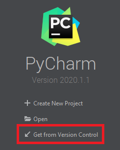
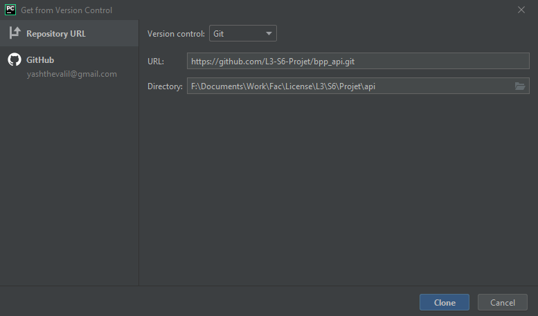
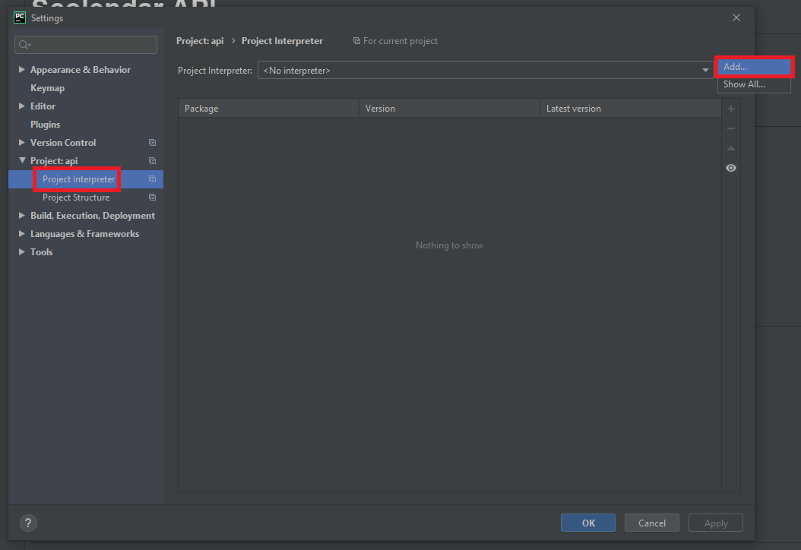
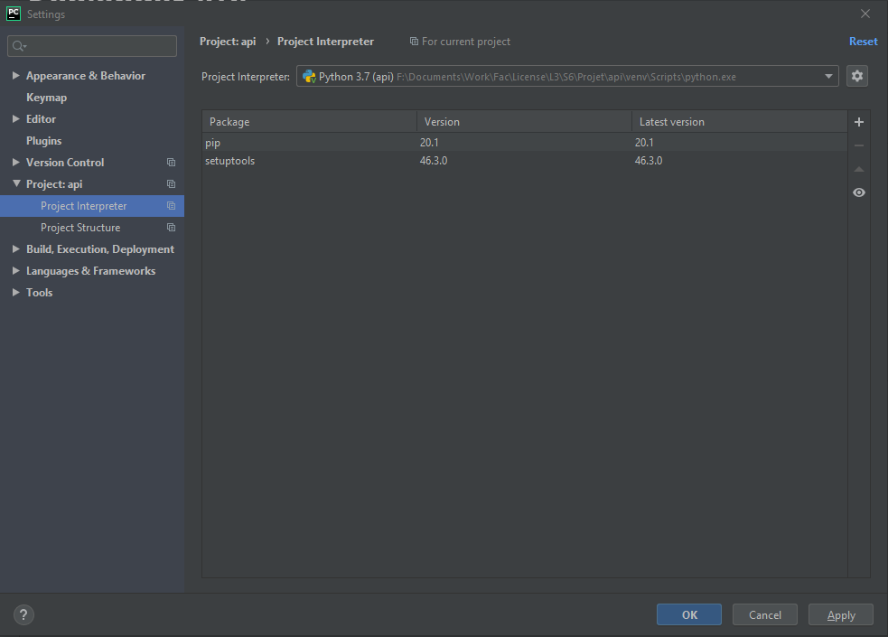
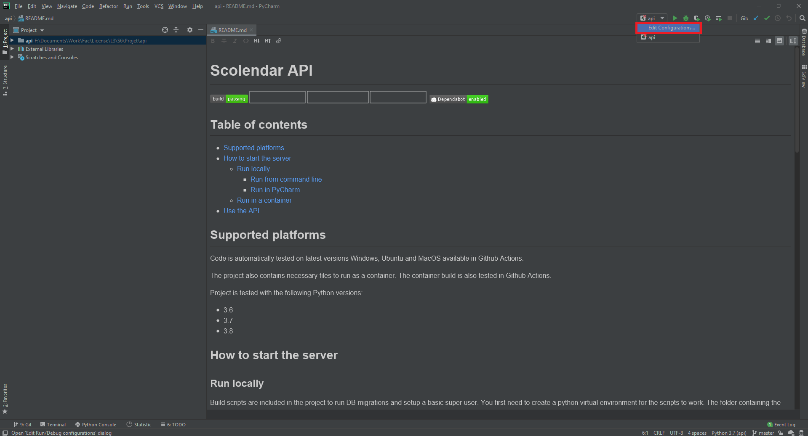
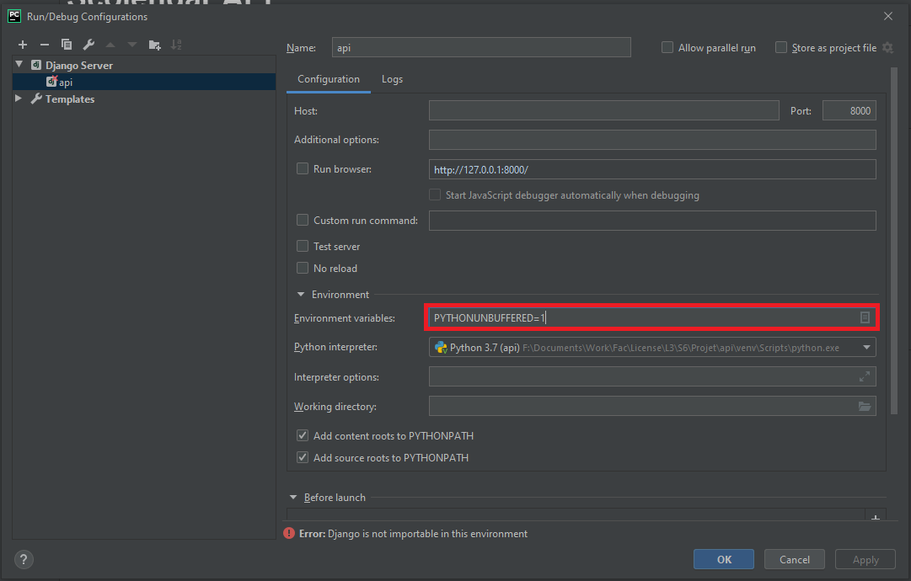
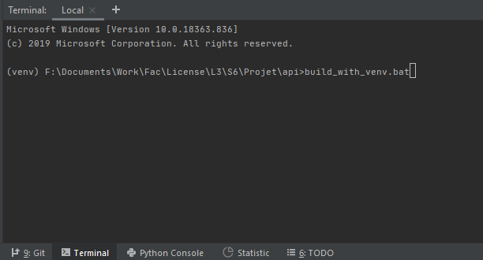

# Scolendar API
[](https://travis-ci.com/tag166tt/l3_s6_projet_bdd_api)


[](https://dependabot.com/)

## Table of contents
  * [Supported platforms](#supported-platforms)
  * [How to start the server](#how-to-start-the-server)
    + [Run locally](#run-locally)
        - [Run from command line](#run-from-command-line)
        - [Run in PyCharm](#run-in-pycharm)
    + [Run in a container](#run-in-a-container)
  * [Use the API](#use-the-api)

## Supported platforms
Code is automatically tested on latest versions Windows, Ubuntu and MacOS available in Github Actions.

The project also contains necessary files to run as a container. The container build is also tested in Github Actions.

Project is tested with the following Python versions:
- 3.6
- 3.7
- 3.8

## How to start the server
### Run locally
Build scripts are included in the project to run DB migrations and setup a basic super user. You first need to create a python virtual environment for the scripts to work.
The folder containing the virtual environment should be named:
- `venv` on Windows
- `.venv` on Linux

Let PyCharm create it on Windows, and if you're on Linux, you should know how to do this anyway 😊

The scripts will take a long time to run because premature optimization is the root of all evil. Just let it run, and don't panic.

The scripts should be run before starting the app. The following guide will show you how to add the proper script to run before build.

#### Run from command line
When running from command line, be sure to run the proper script first.
Then, run the command:
```shell script
python manage.py runserver 0:8000
```
Then open your browser and go to http://127.0.0.1:8000/swagger

#### Run in PyCharm
##### Setup
First, you need to install Python (3.7 is preferred since the code was written for this version).

##### Cloning
Clone the repository to your computer (using PyCharm or directly from command line).




##### Interpreter setup
One the project is cloned, you need to setup the Python Interpreter. Open the PyCharm settings. You will find the project setup details in that window.



In this window, click on the small wheel and add a Python Interpreter


Once the virtual environment is created, you should see the following window:



Click "Apply", then "OK".

##### Run configuration
Open the run configurations edition window



In this window, check the environment variables are set to the following values:
- PYTHONUNBUFFERED=1
- DJANGO_SETTINGS_MODULE=enseign.settings



**An error still appears, which is normal at this step.**

Click "Apply", then "OK".

##### Script
You can now run the script which will install all dependencies and initialize the database with test data.


You can now click on the Run button to start the server and navigate to http://127.0.0.1:8000/swagger

### Run in a container
The project can be run in a container.

You first need to build the container:
```shell script
docker build --tag scolendar:1.0 .
```

Once the build is done, you can run the container with the following command:
```shell script
docker run --publish 8000:8000 --detach --name scolendar scolendar:1.0
```

## Use the API
All test users have the same password : `passwdtest`.
Their usernames are:
- Super user: `super`
- Admin: `admin`
- Student: same as in test server `{first_name}.{last_name}`
- Teacher: same as in test server `{first_name}.{last_name}`

**All default usernames do not contain special characters.**

A default class is also created: `L3 Informatique`.
